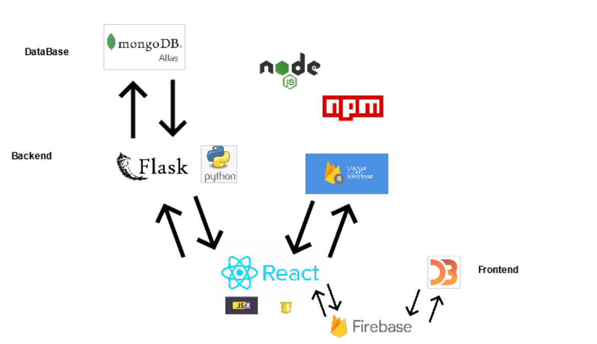

<h2 align="center">
    Final Year Project
</h3>

<h3 align="center">
    Data Visualisation & Analysis based on various Pandemic data sets
</h4>

<p align="center">
  
</p>

## Project Details
Heading     | Details
------------|-------------------------------------
Course      | BSc (Hons) in Software Development
Module      | Applied Project & Minor Dissertation
Authors     | Grace Keane, Shirin Nagle, Jina Kim 
ID          | G00359990, G00363458, G00353420
Video       | [Demo Video](https://web.microsoftstream.com/video/d8ab7e52-3528-47bb-8ffe-b484f0ca3987?list=studio)
Heroku      | [Deploid Project](https://final-year-project-data-visual.herokuapp.com/)
Dissertation| View Dissertation
ID          | G00359990, G00363458, G00353420
Supervisor  | Dr John French

## Contents
- [About](#project-overview)
- [Software Requirements](#software-requirements)
- [Run Locally](#run-locally)
- [Technology stack](#technology-stack)
- [Designated Tasks](#designated-tasks)
- [Screens](#screens)
- [References](#referances)

## Project Overview
Data visualisation and analysis techniques have been the front and center in the efforts to communicate the statistics as well as the science around the COVID-19 virus. Interactive dashboards with several charts and graphs surfaced in different formats to offer concise ways to make sense of complex and overwhelming pandemic data sets. These techniques have become essential in informing the general public as well as healthcare providers, scientists and governments of the overall COVID-19 growth. 

As a result, the team felt it would be beneficial as well as informative to create a web application that would take large COVID-19 data sets as well as other epidemic data and create a series of data visualisations from it. As well as compare past and present viruses to distinguish similarities along with differences. This would provide a clear view of COVID-19 and how similar viruses have spread. 

## Software Requirements
- [Visual Studio Code](https://code.visualstudio.com/download)
- [Anaconda3 Version (Python 3.8.5)](https://www.anaconda.com/products/individual)
- [MongoDB Atlas](https://www.mongodb.com/cloud/atlas/lp/try2?utm_source=google&utm_campaign=gs_emea_ireland_search_core_brand_atlas_desktop&utm_term=mongodb%20atlas&utm_medium=cpc_paid_search&utm_ad=e&utm_ad_campaign_id=12212624527&gclid=Cj0KCQiA-aGCBhCwARIsAHDl5x8_dfnh9PWedNlnlRjFzg8yn4SIV5UxJTl9bBAb7SfrZy6IE2JXCdoaAp7tEALw_wcB)
- [Firebase](https://firebase.google.com/)
- [Node v14.15.1 ](https://nodejs.org/en/download/)
- [Heroku](https://www.heroku.com/)

## Run Locally
1) Create a folder to clone the project code.
2) In your command line terminal navigate to the folders location.
3) In your command line terminal enter: `git clone https://github.com/4th-year-project-2020-2021/Final-Year-Project-Data-Visualization.git`
4) When the project has finished cloning, change directory to the project root folder: cd Final-Year-Project-Data-Visualization
5) To install all project dependencies enter: `npm install`
6) Start the development server: `npm start`
7) Navigate to http://localhost:3000/ on your browser.

### Running the Tests
1) cd into the <b>/program/</b> directory
2) `cd api`
3) `cd Tests`
4) In the terminal type: `pytest`

### Running the Web Service
```bash
$ pip install -r requirements.txt
$ cd api
$ flask run
 * Running on http://127.0.0.1:5000/
 ```

## Technology stack
- React in the Client side as well as Javscript, jsx data visualisations (Covid-19, Stats).
- Flask, MongoDB in the backend.
- Mongo Atlas as Managed Mongo Database service in the cloud.
- Heroku Cloud Platform for deploying API and React App.
- D3 for Data visualization. (Inside Mers,Sars,Comparison components)
- Firebase Realtime Database for handling user authenticaton and storing Mers, Sars, Comparison datasets.
- Cloud Firestore (cloud-hosted, NoSQL database) for discussion page (User can Create, Read, Update, Delete their messages in this page).

<p align="center">
  
</p>


## Designated Tasks
### Grace - Live and interactive Covid-19 component, Home component, Stats component and Selenium testing
- [x] World Maps using API
- [x] Glabal and interactive data cards 
- [x] Drop down function
- [x] Covid-19 table
- [x] Interactive Covid-19 map
- [x] Covid-19 last 120 days Line Graph
- [x] Covid-19 Vaccinated chart
- [x] Home Screen styling
- [x] Add review database functionality
- [x] Stats country selection feature
- [x] Stats overlay line and bar chart
- [x] Selenium Testing of all frontend links and buttons
- [x] Dissertation writing

### Jina - Mers_Sars component, Comparison component, Login & Resgister compoment (Firebase), Profile component, Message board component (Cloud Firestore) and Firebase Functions Testing with JEST and Firebase Emulators
The main purpose of every work is that making interactive visualization applications and integrating D3.js in React.
- [x] Interactive D3 Bar charts with dropdown function Flicking between datasets
- [x] Interactive D3 Scatter plots
- [x] Interactive D3 Line graphs
- [x] Interactive D3 pie chart
- [x] D3 Mouse Events: mouseover, mouseout
- [x] Comparison page. (Comparisions of Covid-19, Mers and Sars) - Data Visualization with D3
- [x] Mers and Sars page. - Data Visualization with D3
- [x] Firebase AuthProvider (email, password)
- [x] Login with: Google, Facebook, Github etc... (Firebase)
- [x] Profile page. - users can edit their profile name ( Firebase )
- [x] Firestore message functionality - Added CRUD(Create, read, update and delete) functionalities. 
- [x] Dissertation writing

### Shirin - Smallpox component, Home component & Upload component & React Testing
- [x] Smallpox - interactive bar and line charts
- [x] Data tier to MongoDB Atlas
- [x] Auto Generated Graph
- [x] Flask backend - create and read
- [x] Home Screen - ratings and review functionality
- [x] Dissertation writing
- [x] Symptoms page, enter details record a temperature, graph of recorded temperatures is generated.
- [x] Screen cast
- [x] Team meeting coordination
- [x] Deployed project to Heroku
- [x] Tested API routes with Postman

## Screens
- Home
- Covid-19
- Stats
- Mers and Sars
- Comparison
- Small pox
- Symptom
- Message Board
- Login & Register
- Profile
- Discussion

## Referances
[1] COVID-19 Page data - https://www.disease.sh/ <br>
[3] COVID-19 Stats page data - https://github.com/mathdroid/covid-19-api <br>
[4] Mers and Sars datasets - https://www.kaggle.com/ <br>
[5] Sars outbreak - https://www.ncbi.nlm.nih.gov/pmc/articles/PMC7312089/<br>
[6] Sars - https://www.who.int/csr/sars/country/2003_07_11/en/<br>
[7] Used to get information for Sars and Mers) - https://journals.sagepub.com/doi/full/10.1177/0165551520954674<br>
[8] Difference between Flu and COVID-19 - https://www.cdc.gov/flu/symptoms/flu-vs-covid19.htm<br>
[9] Smallpox data https://ourworldindata.org/smallpox<br>
[10] Mers data https://www.hindawi.com/journals/bmri/2020/9629747/<br>
[11] Comparisons of Mers,Sars,Covid-19 https://pulmonarychronicles.com/index.php/pulmonarychronicles/article/view/795/1687 <br>
[12] The SARS outbreak of 2003; https://www.cdc.gov/sars/about/fs-sars.html <br>
